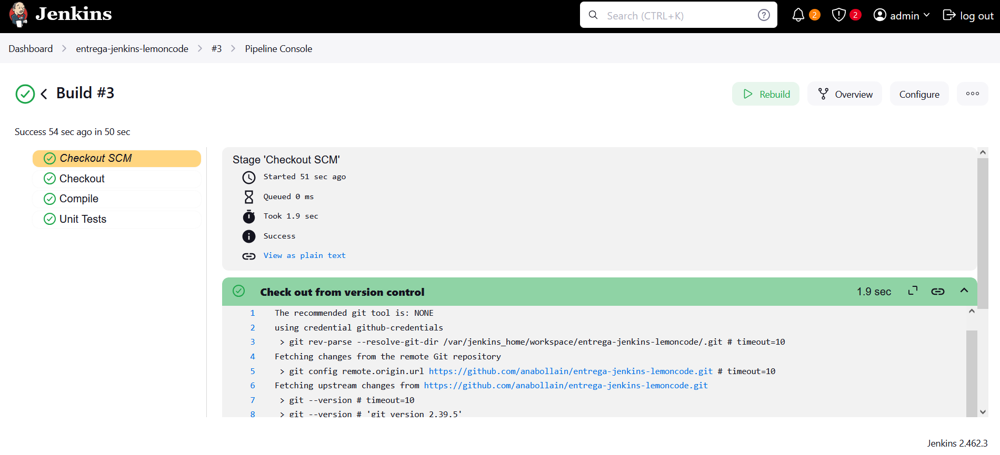
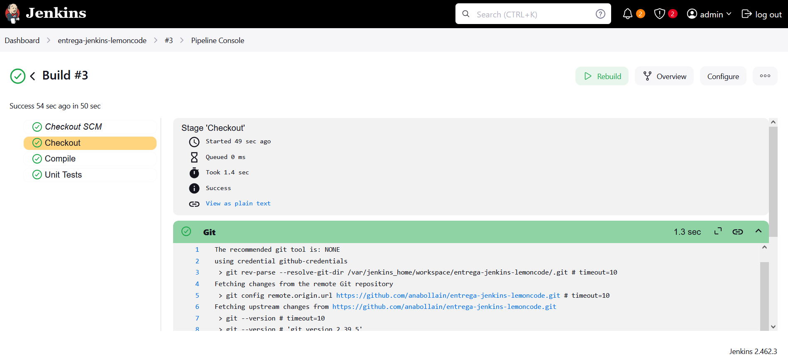
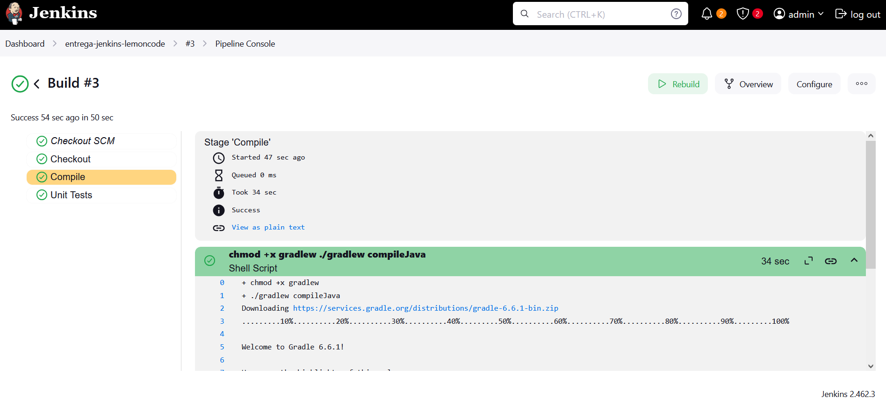
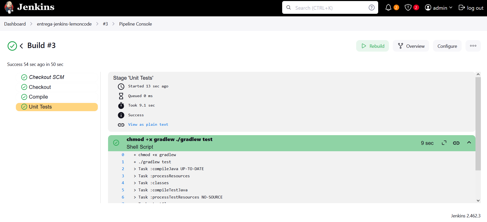

# Ejercicios Jenkins

## 1. CI/CD de una Java + Gradle - OBLIGATORIO

### Enunciado

En el directorio raíz de este [código fuente](./jenkins-resources), crea un `Jenkinsfile` que contenga una pipeline declarativa con los siguientes stages:

* **Checkout**. Descarga de código desde un repositorio remoto, preferentemente utiliza GitHub
* **Compile**. Compilar el código fuente utilizando `gradlew compileJava`
* **Unit Tests**. Ejecutar los test unitarios utilizando `gradlew test`

Para ejecutar Jenkins en local y tener las dependencias necesarias disponibles podemos construir una imagen a partir de [este Dockerfile](./jenkins-resources/gradle.Dockerfile)

### Resolución 

#### 1. Crea un repositorio en GitHub

- Crea un nuevo repositorio privado llamado `entrega-jenkins-lemoncode`.

- Clona el repositorio a través del siguiente comando:

```bash
https://github.com/anabollain/entrega-jenkins-lemoncode.git
```

- Crea la estructura base del proyecto con los archivos facilitados en el directorio `./jenkins-resources`.

- Sube los cambios al repositorio:

```bash
git add .
git commit -m "Initial commit"
git push origin main
```

#### 2. Configura el entorno trabajo en Jenkins

- Construye la imagen:

```bash
docker build -f gradle.Dockerfile -t gradle-jenkins .
```

- Ejecuta un contenedor:

```bash
docker run -d --name entrega-jenkins-lemoncode -p 8080:8080 gradle-jenkins
```

- Accede desde el navegador a `http://localhost:8080`.

- Recupera la contraseña a través del siguiente comando:

```bash
docker exec -it entrega-jenkins-lemoncode cat /var/jenkins_home/secrets/initialAdminPassword
```

- Introduce la contraseña recuperada (`e22fafa1206946e688efdc28f514951d`).

- Selecciona "Install suggested plugins".

- Selecciona la opción "Skip and continue as admin".

- Mantén la ruta por defecto (`http://localhost:8080/`) y finaliza.

#### 3. Crea un token personal de acceso en GitHub

Desde GitHub:

- Haz clic en tu avatar (esquina superior derecha) y ve a `Settings`.

- Accede a `Developer settings > Personal access tokens > Fine-grained tokens` al final del menú lateral.

- Haz clic en `Generate new token`.

- Asigna un nombre descriptivo como `entrega-jenkins-lemoncode` y una validez de 30 días.

- En `Repository access`:
    - Selecciona la opción `All repositories` para tenerlo accesible para pruebas generales.

- En `Permissions > Repository permissions`, selecciona `Read and write` para:
    - Commit Statuses (permite a Jenkins actualizar el estado del build en los commits)
    - Contents
    - Pull requests
- Genera el token y copialo en el portapapeles.

#### 4. Configura las credenciales en Jenkins

- Accede a Jenkins desde `http://localhost:8080`.

- Ve a `Manage Jenkins > Credentials` y selecciona el almacén `global`.

- Haz clic en `Add credentials`.

- Rellena el formulario con los siguientes datos:
  - **Kind**: `Username with password`.
  - **Scope**: `Global`.
  - **Username**: Tu nombre de usuario de GitHub (`anabollain`).
  - **Password**: Token generado previamente en GitHub.
  - ID: `github-credentials`.
  - Description: `GitHub Personal Access Token`.

#### 5. Configura la pipeline 

- Crea un archivo `Jenkinsfile` con el siguiente contenido:

```groovy
pipeline {
    agent any

    stages {
        stage('Checkout') {
            steps {
                // Clone code from GitHub repository
                git credentialsId: 'github-credentials', url: 'https://github.com/anabollain/entrega-jenkins-lemoncode.git', branch: 'main'
            }
        }

        stage('Compile') {
            steps {
                // Run the Gradle compile command
                dir('calculator') {
                    sh './gradlew compileJava'
                }
            }
        }

        stage('Unit Tests') {
            steps {
                // Run the Gradle tests
                dir('calculator') {
                    sh './gradlew test'
                }
            }
        }
    }
}
```

- Sube los cambios al repositorio:

```bash
git add .
git commit -m "Added Jenkinsfile"
```

#### 6. Crea la pipeline en Jenkins

- Desde el Dashboard, haz clic en `New Item`.

- Asigna el nombre `entrega-jenkins-lemoncode` y selecciona el tipo `Pipeline`.

- En la configuración:
  - **Definition**: `Pipeline script from SCM` (Source Control Manager).
  - **SCM**: `Git`.
  - **Repository URL**: URL HTTPS del repositorio (`https://github.com/anabollain/entrega-jenkins-lemoncode.git`).
  - **Credentials**: Selecciona `github-credentials`.
  - **Branch Specifier**: Reemplaza `master` por `main`.
  - **Script Path**: `./Jenkinsfile`.
  - Deja el resto de opciones por defecto y guarda.

#### 7. Ejecuta la pipeline y revisa los logs

- Haz clic en `Build now`.

- Revisa el `Console Output`, verás el siguiente error:

```bash
[Pipeline] // stage
[Pipeline] stage
[Pipeline] { (Compile)
[Pipeline] dir
Running in /var/jenkins_home/workspace/entrega-jenkins-lemoncode/calculator
[Pipeline] {
[Pipeline] sh
+ ./gradlew compileJava
/var/jenkins_home/workspace/entrega-jenkins-lemoncode/calculator@tmp/durable-3244aba6/script.sh.copy: 1: ./gradlew: Permission denied
[Pipeline] }
[Pipeline] // dir
[Pipeline] }
```

#### 8. Corrige posibles errores

- Ajusta el contenido `Jenkinsfile` para otorgar permisos de ejecución:

```diff
pipeline {
    agent any // Run this pipeline on any available agent

    stages {
        stage('Checkout') {
            steps {
                // Checkout the source code from the GitHub repository
                // Using stored credentials (ID: 'github-credentials') to access a private repository
                git credentialsId: 'github-credentials', url: 'https://github.com/anabollain/entrega-jenkins-lemoncode.git', branch: 'main'
            }
        }

        stage('Compile') {
            steps {
                // Compile Java source code using Gradle
+               dir('calculator') {
+                   sh '''
+                       chmod +x gradlew
+                       ./gradlew compileJava
+                   '''
                }
            }
        }

        stage('Unit Tests') {
            steps {
                // Run unit tests with Gradle
                dir('calculator') {
+                   sh '''
+                       chmod +x gradlew
+                       ./gradlew test
+                   '''
                }
            }
        }
    }
}
```

- Sube los cambios al repositorio:

```bash
git add .
git commit -m "Modified Jenkinsfile to grant permissions"
```

#### 8. Ejecuta de nuevo la pipeline

Una vez verificado que no hay errores...:









---

## 2. Modificar la pipeline para que utilice la imagen Docker de Gradle como build runner

### Enunciado

* Utilizar Docker in Docker a la hora de levantar Jenkins para realizar este ejercicio
* Como plugins deben estar instalados `Docker` y `Docker Pipeline`
* Usar la imagen de Docker `gradle:6.6.1-jre14-openj9`

### Resolución

#### 1.

```bash
docker stop entrega-jenkins-lemoncode
```

#### 2. Crea un `docker-compose.yml`

```bash
services:
  docker:
    image: docker:dind # Use Docker-in-Docker image to run a Docker daemon inside a container
    container_name: jenkins-docker
    privileged: true # Required to run Docker inside Docker (gives extended privileges)
    restart: unless-stopped # Automatically restart the container unless it's explicitly stopped
    environment:
      DOCKER_TLS_CERTDIR: /certs # Directory where Docker stores TLS certificates
    volumes:
      - docker_certs:/certs/client # Mount the docker_certs volume to share client certs
      - jenkins_home:/var/jenkins_home # Shared Jenkins home directory for persistence

  jenkins:
    build:
      context: . # Use the current directory for building the custom Docker image
      dockerfile: gradle.Dockerfile # Path to your custom Dockerfile
      args:
        GRADLE_VERSION: 6.6.1 # Pass the GRADLE_VERSION argument to the Dockerfile
    container_name: jenkins-gradle
    restart: unless-stopped
    environment:
      DOCKER_HOST: tcp://docker:2376 # Connect Jenkins to the Docker daemon running in the 'docker' service
      DOCKER_CERT_PATH: /certs/client # Path to Docker client certificates inside the container
      DOCKER_TLS_VERIFY: 1 # Enable TLS verification when connecting to the Docker daemon
    volumes:
      - docker_certs:/certs/client:ro # Mount the certificates volume as read-only
      - jenkins_home:/var/jenkins_home # Mount Jenkins home directory for data persistence
    ports:
      - 8080:8080 # Expose Jenkins web interface
      - 50000:50000 # Expose Jenkins agent port (for connecting build agents)

volumes:
  docker_certs: # Named volume to store Docker certificates
  jenkins_home: # Named volume to store Jenkins data
```

#### 3. Levanta el entorno

- Ejecuta:

```bash
docker compose up
```

- Accede a `localhost:8080` e introduce las credenciales:

    - Username: `admin`
    - Password: `12f8aebf9e0542a6a2af9188f1d8f4e8`

```bash
docker exec -it jenkins-gradle cat /var/jenkins_home/secrets/initialAdminPassword
```

#### 4. Plugins

En la sección de **Plugins**, asegúrate de tener instalados los siguientes (o instalarlos si no están):

- Docker
- Docker Pipeline

Para aplicar los cambios tras la instalación, marca la casilla "Restart Jenkins when installation is complete and no jobs are running" al final del listado. Jenkins se reiniciará y tendrás que volver a iniciar sesión con las credenciales creadas.

#### 5. Sube los cambios al repositorio

```bash
git add .
git commit -m "Added docker-compose.yml"
```
#### 6. Configura las credenciales en Jenkins

- Accede a Jenkins desde `http://localhost:8080`.

- Ve a `Manage Jenkins > Credentials` y selecciona el almacén `global`.

- Haz clic en `Add credentials`.

- Rellena el formulario con los siguientes datos:
  - **Kind**: `Username with password`.
  - **Scope**: `Global`.
  - **Username**: Tu nombre de usuario de GitHub (`anabollain`).
  - **Password**: Token generado previamente en GitHub.
  - ID: `github-credentials`.
  - Description: `GitHub Personal Access Token`.

#### 7. Crea la pipeline en Jenkins

- Desde el Dashboard, haz clic en `New Item`.

- Asigna el nombre `entrega-jenkins-lemoncode` y selecciona el tipo `Pipeline`.

- En la configuración:
  - **Definition**: `Pipeline script from SCM` (Source Control Manager).
  - **SCM**: `Git`.
  - **Repository URL**: URL HTTPS del repositorio.
  - **Credentials**: Selecciona `github-credentials`.
  - **Branch Specifier**: Reemplaza `master` por `main`.
  - **Script Path**: `./Jenkinsfile`.
  - Deja el resto de opciones por defecto y guarda.
